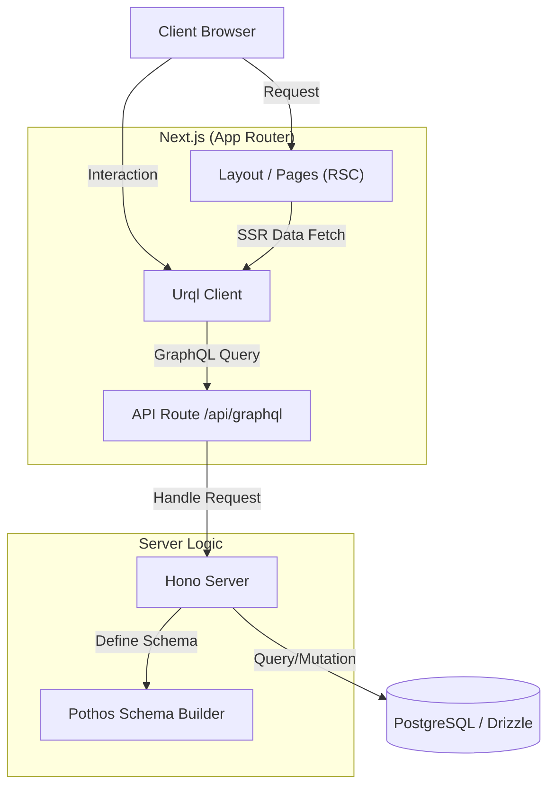
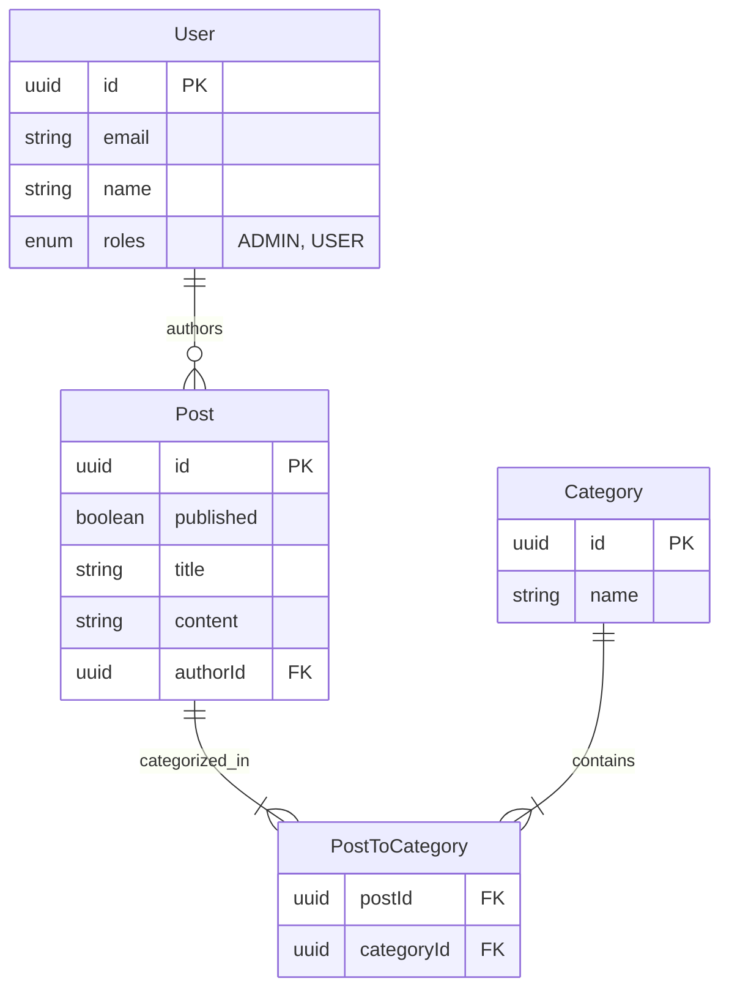

# next-drizzle

Next.js、Drizzle ORM、GraphQL で構築された実装サンプルです。このプロジェクトは、効率的なデータ管理とレンダリングのための最新技術を使用したフルスタックアーキテクチャを実証しています。

## 機能

- **投稿管理:**
  - 投稿リストの表示（ホームページ）。
  - 新規投稿の作成（タイトル、コンテンツ、公開ステータス、カテゴリ）。
  - 既存の投稿の編集。
  - 投稿の削除。
  - 下書きシステム（公開/非公開投稿）。
- **ユーザーシステム:**
  - ユーザー切り替え/認証（デモ用に簡略化/シミュレート）。
  - ユーザーロール。
- **カテゴリ管理:**
  - 投稿のカテゴリ分け。

## 技術スタック

- **フレームワーク:** [Next.js](https://nextjs.org/) (App Router)
- **言語:** TypeScript
- **データベース:** PostgreSQL
- **ORM:** [Drizzle ORM](https://orm.drizzle.team/)
- **API:** GraphQL (サーバー: Hono + Pothos, クライアント: Urql)
- **スタイリング:** Tailwind CSS
- **認証:** カスタム JWT 認証
- **コード生成:** GraphQL Codegen

### アーキテクチャ概要



## はじめに

### 前提条件

- Node.js (v18+)
- pnpm (推奨）または npm/yarn
- Docker (データベース用）

### インストールとセットアップ

1.  **依存関係のインストール:**

    ```bash
    pnpm install
    ```

2.  **データベースの起動:**
    Docker Compose を使用して PostgreSQL を起動します。

    ```bash
    pnpm docker
    ```

3.  **データベースのセットアップ (マイグレーション & シード):**
    スキーマの初期化とシードデータのロードを行います。

    ```bash
    pnpm drizzle:reset
    ```

4.  **開発サーバーの起動:**

    ```bash
    pnpm dev
    ```

5.  **アプリケーションへのアクセス:**
    ブラウザで [http://localhost:3000](http://localhost:3000) を開きます。

## スクリプト

- `dev`: Next.js 開発サーバーを起動します。
- `docker`: PostgreSQL コンテナを起動します。
- `graphql:codegen`: GraphQL の変更を監視し、TypeScript の型を生成します。
- `graphql:schema`: GraphQL スキーマをエクスポートします。
- `drizzle:generate`: スキーマ変更に基づいて SQL マイグレーションを生成します。
- `drizzle:migrate`: マイグレーションをデータベースに適用します。
- `drizzle:seed`: テストデータをデータベースにシードします。
- `drizzle:reset`: データベースをリセットします（マイグレーション + シード）。
- `lint`: ESLint を実行します。

## アーキテクチャと実装詳細

このプロジェクトでは、コードファーストアプローチを使用して GraphQL スキーマを生成し、軽量なサーバーセットアップと堅牢な認証システムを実装しています。

### GraphQL サーバーとスキーマ設計

本プロジェクトでは、**Code-First** アプローチを採用し、型安全性と開発効率を最大化しています。

#### 1. データモデル (ER 図)



#### 2. スキーマの自動生成 (`src/server/builder.ts`)

[Pothos](https://pothos-graphql.dev/) と Drizzle プラグインを組み合わせることで、DB スキーマから GraphQL スキーマを自動生成します。

- **自動化**: `drizzle-orm` の定義を読み取り、Query/Mutation を即座に作成。
- **セキュリティ (RLS)**:
  - `executable`: 認証済みユーザーのみ Mutation を許可。
  - `where`: ユーザー ID に基づき、取得・更新できるデータを自動フィルタリング（行レベルセキュリティ）。
- **カスタマイズ**: 中間テーブルの除外や、システム管理フィールド（`createdAt` など）の入力不可設定。

```ts
import SchemaBuilder from "@pothos/core";
import DrizzlePlugin from "@pothos/plugin-drizzle";
import { getTableConfig } from "drizzle-orm/pg-core";
import { GraphQLSchema } from "graphql";
import { setCookie } from "hono/cookie";
import { SignJWT } from "jose";
import PothosDrizzleGeneratorPlugin, {
  isOperation,
} from "pothos-drizzle-generator";
import { relations } from "../db/relations";
import type { Context } from "./context";
import type { Context as HonoContext } from "hono";
import { getEnvVariable } from "../libs/getEnvVariable";
import { db } from "./drizzle";

// Secret key for JWT token signing and verification
const SECRET = getEnvVariable("SECRET");

// JWT token expiration time: 400 days in seconds
const TOKEN_MAX_AGE = 60 * 60 * 24 * 400;

// Cookie configuration shared across authentication operations
const COOKIE_OPTIONS = {
  httpOnly: true,
  sameSite: "strict" as const,
  path: "/",
};

// Tables to exclude from GraphQL schema generation
// Junction tables like "postsToCategories" are typically excluded
const EXCLUDE_TABLES: Array<keyof typeof relations> = ["postsToCategories"];

export interface PothosTypes {
  DrizzleRelations: typeof relations;
  Context: HonoContext<Context>;
}

/**
 * Initialize Pothos Schema Builder with plugins:
 * - DrizzlePlugin: Integrates Drizzle ORM with Pothos
 * - PothosDrizzleGeneratorPlugin: Automatically generates GraphQL schema from Drizzle schema
 */
const builder = new SchemaBuilder<PothosTypes>({
  plugins: [DrizzlePlugin, PothosDrizzleGeneratorPlugin],
  drizzle: {
    client: () => db,
    relations,
    getTableConfig,
  },
  pothosDrizzleGenerator: {
    // Exclude specific tables from schema generation (e.g., junction tables)
    use: { exclude: EXCLUDE_TABLES },
    // Global configuration applied to all models
    all: {
      // Maximum query depth to prevent deeply nested queries (protection against DoS)
      depthLimit: () => 5,
      // Controls whether operations (findMany, findFirst, count, create, update, delete) are executable
      // This guards against unauthorized mutations by requiring authentication
      executable: ({ operation, ctx }) => {
        if (isOperation(["mutation"], operation) && !ctx.get("user")) {
          return false;
        }
        return true;
      },
      // Configure input fields for create/update operations
      // Excludes auto-managed system fields from user input
      inputFields: () => {
        return { exclude: ["createdAt", "updatedAt"] };
      },
    },
    // Model-specific configuration
    models: {
      posts: {
        // Automatically inject data during create/update operations
        // Sets authorId to the current authenticated user
        inputData: ({ ctx }) => {
          const user = ctx.get("user");
          if (!user) throw new Error("No permission");
          return { authorId: user.id };
        },
        // Apply WHERE clause filters based on operation type
        // This implements row-level security
        where: ({ ctx, operation }) => {
          // For queries (findMany, findFirst, count): show published posts or user's own posts
          if (isOperation(["query"], operation)) {
            return {
              OR: [{ authorId: ctx.get("user")?.id }, { published: true }],
            };
          }
          // For mutations (create, update, delete): only allow operations on user's own posts
          if (isOperation(["mutation"], operation)) {
            return { authorId: ctx.get("user")?.id };
          }
        },
      },
    },
  },
});

builder.queryType({
  fields: (t) => ({
    // Returns the currently authenticated user
    me: t.drizzleField({
      type: "users",
      nullable: true,
      resolve: (_query, _root, _args, ctx) => {
        const user = ctx.get("user");
        return user || null;
      },
    }),
  }),
});

/**
 * Authentication mutations
 * Provides user authentication functionality including sign-in, sign-out, and current user retrieval
 */
builder.mutationType({
  fields: (t) => ({
    // Authenticates a user by email and sets JWT cookie
    signIn: t.drizzleField({
      args: { email: t.arg({ type: "String" }) },
      type: "users",
      nullable: true,
      resolve: async (_query, _root, { email }, ctx) => {
        const user =
          email &&
          (await db.query.users.findFirst({ where: { email: email } }));
        if (!user) {
          // Authentication failed: clear any existing auth cookie
          setCookie(ctx, "auth-token", "", { ...COOKIE_OPTIONS, maxAge: 0 });
        } else {
          // Authentication successful: generate JWT and set secure cookie
          const token = await new SignJWT({ user: user })
            .setProtectedHeader({ alg: "HS256" })
            .sign(new TextEncoder().encode(SECRET));
          setCookie(ctx, "auth-token", token, {
            ...COOKIE_OPTIONS,
            maxAge: TOKEN_MAX_AGE,
          });
        }
        return user || null;
      },
    }),
    // Signs out the current user by clearing the authentication cookie
    signOut: t.field({
      args: {},
      type: "Boolean",
      nullable: true,
      resolve: async (_root, _args, ctx) => {
        setCookie(ctx, "auth-token", "", { ...COOKIE_OPTIONS, maxAge: 0 });
        return true;
      },
    }),
  }),
});

export const schema: GraphQLSchema = builder.toSchema({ sortSchema: false });
```

#### 3. Hono によるサーバー構築 (`src/server/hono.ts`)

GraphQL サーバーの実体には、軽量・高速な [Hono](https://hono.dev/) を使用しています。

- **認証ミドルウェア**: Cookie 内の JWT を検証し、コンテキストに `user` をセットします。
- **Apollo Explorer**: ブラウザでアクセスした際に、クエリをテストできる IDE を提供します。
- **GraphQL エンドポイント**: `@hono/graphql-server` を使用してリクエストを処理します。

```ts
import { graphqlServer } from "@hono/graphql-server";
import { explorer } from "apollo-explorer/html";
import { generate } from "graphql-auto-query";
import { Hono } from "hono";
import { contextStorage } from "hono/context-storage";
import { getContext } from "hono/context-storage";
import { getCookie } from "hono/cookie";
import { jwtVerify } from "jose";
import { schema } from "./builder";
import type { Context } from "./context.js";
import type { relations } from "../db/relations";
import type { Context as HonoContext } from "hono";
import { getEnvVariable } from "@/libs/getEnvVariable";

// Secret key for JWT verification
const SECRET = getEnvVariable("SECRET");

// Cookie name for authentication token
const AUTH_TOKEN_COOKIE = "auth-token";

// Apollo Explorer introspection interval (10 seconds)
const INTROSPECTION_INTERVAL = 10000;

// Sample query generation depth
const QUERY_GENERATION_DEPTH = 1;

/**
 * Middleware to extract and verify JWT token from cookies
 * Sets the authenticated user in the request context
 */
const authMiddleware = async (
  c: HonoContext<Context>,
  next: () => Promise<void>
) => {
  const cookies = getCookie(c);
  const token = cookies[AUTH_TOKEN_COOKIE] ?? "";

  /**
   * Verify JWT token and extract user information
   * If verification fails (invalid/expired token), user will be undefined
   */
  const user = await jwtVerify(token, new TextEncoder().encode(SECRET))
    .then(
      (data) => data.payload.user as typeof relations.users.table.$inferSelect
    )
    .catch(() => undefined);
  // Store user in request context
  const context = getContext<Context>();
  context.set("user", user);

  return next();
};

/**
 * Initialize Hono application with custom context type
 * The Context type provides type-safe access to user authentication state
 */
export const app = new Hono<Context>();

/**
 * Enable context storage middleware
 * This allows access to the request context from anywhere in the application
 */
app.use(contextStorage());

/**
 * Apollo Explorer endpoint
 * Provides an interactive GraphQL IDE for testing queries and mutations
 */
app.get("*", (c) => {
  return c.html(
    explorer({
      initialState: {
        // Auto-generate sample GraphQL operations from the schema
        document: generate(schema, QUERY_GENERATION_DEPTH),
      },
      // GraphQL endpoint URL for the explorer to connect to
      endpointUrl: c.req.url,
      // Automatically refresh schema periodically
      introspectionInterval: INTROSPECTION_INTERVAL,
    })
  );
});

/**
 * GraphQL endpoint
 * Handles GraphQL queries and mutations via POST requests
 * Authentication is handled by the authMiddleware
 */
app.post("*", authMiddleware, (c, next) => {
  return graphqlServer({
    schema,
  })(c, next);
});
```

#### 4. Next.js Route Handler への統合 (`src/app/api/graphql/route.ts`)

Hono で構築したサーバーは Web Standard API に準拠しているため、Next.js の Route Handler としてそのままマウント可能です。

```ts
"use server";
import { app } from "../../../server/hono";

export async function POST(request: Request) {
  return app.fetch(request);
}

export async function GET(request: Request) {
  return app.fetch(request);
}
```

### 認証と認可

セキュリティと使いやすさを考慮したカスタム認証システムを実装しています。

#### 1. 認証の仕組み (サーバーサイド)

- **サインインフロー:**

  - ユーザーはメールアドレスでサインインします（デモ用のためパスワードレス）。
  - `signIn` ミューテーション (`src/server/builder.ts`) がユーザーを検証し、成功すると `jose` ライブラリで JWT (JSON Web Token) を生成します。
  - トークンは `HttpOnly`, `SameSite: Strict` 属性を持つ `auth-token` Cookie として設定され、XSS 攻撃から保護されます。

- **リクエスト検証:**

  - Hono の `authMiddleware` がリクエストごとに Cookie から JWT を検証します。
  - 検証されたユーザー情報は Hono のコンテキスト (`contextStorage`) に保存され、GraphQL リゾルバからアクセス可能になります。

- **セキュリティと認可:**
  - **ミューテーション保護:** Pothos プラグインの設定により、認証されていないユーザーによるデータ変更（ミューテーション）をブロックします。
  - **行レベルセキュリティ (RLS):** クエリやミューテーションに自動的に `where` 句を注入し、ユーザーが自分のデータのみを操作できるように制御します（例：編集は自分の投稿のみ許可）。

#### 2. SSR 時の認証トークンの取り扱い

Next.js の App Router (Server Components) と URQL (Client Components) を組み合わせる際、SSR (Server-Side Rendering) 中に認証済みリクエストを行うための特別な処理を実装しています。

- **課題:**

  - ブラウザからのリクエストには自動的に Cookie が付与されますが、SSR 中に Next.js サーバーから自身の API ルートへ `fetch` する際は、ブラウザの Cookie は自動的に引き継がれません。
  - そのため、URQL クライアントに認証トークンを明示的に渡す必要があります。

- **解決策:**

  1.  **暗号化して渡す (`src/app/layout.tsx`):**

      - ルートレイアウト（Server Component）で Cookie から `auth-token` を取得します。
      - このトークンを `src/libs/encrypt.ts` の `encrypt` 関数で暗号化し、`UrqlProvider` の props として渡します。
      - **目的:** 生のトークンを Client Component の props として露出させるリスクを軽減し、セキュアに SSR コンテキストへ渡すためです。

  2.  **復号して使用する (`src/components/UrqlProvider.tsx`):**

      - `UrqlProvider` 内で `urql` クライアントを初期化する際、`isServerSide` (SSR 中）であるかを判定します。
      - SSR 中であれば、受け取った暗号化トークンを `decrypt` 関数で復号し、GraphQL リクエストの `cookie` ヘッダーに `auth-token=...` として手動で付与します。
      - これにより、SSR 中に生成されるクエリも認証済みとして処理され、初期表示でユーザー固有のデータを正しく取得できます。

      ```mermaid
      sequenceDiagram
          participant Browser
          participant NextServer as Next.js Server (RSC)
          participant UrqlProvider as Urql Provider (SSR)
          participant API as GraphQL API

          Note over Browser, API: Initial Page Load (SSR)
          Browser->>NextServer: Request Page (Cookie: auth-token)
          NextServer->>NextServer: Layout: Read Cookie
          NextServer->>NextServer: Encrypt Token
          NextServer->>UrqlProvider: Pass Encrypted Token (Props)
          UrqlProvider->>UrqlProvider: Decrypt Token
          UrqlProvider->>API: Fetch Query (Header: Cookie=auth-token)
          API-->>UrqlProvider: Data
          UrqlProvider-->>NextServer: Hydrate State
          NextServer-->>Browser: Rendered HTML
      ```

#### 3. フロントエンドでの利用

フロントエンドでは、認証状態を管理し、ユーザー体験をスムーズにするために以下の仕組みを採用しています。

- **状態管理 (`src/components/StoreProvider.tsx`):**

  - カスタムの `StoreProvider` と `useSyncExternalStore` (React 18) を使用し、アプリケーション全体で軽量かつ効率的にログインユーザー情報を管理しています。

- **カスタムフック (`src/hooks/useAuth.ts`):**

  - `useUser()`: 現在ログインしているユーザー情報を取得します。
  - `useSignIn()`: GraphQL の `signIn` ミューテーションを実行し、成功時にストアを更新します。
  - `useSignOut()`: `signOut` ミューテーションで Cookie をクリアし、ストアの状態をリセットします。

- **実装例 (`src/app/users/page.tsx`):**
  - ユーザー一覧画面の "Sign In" ボタンは、`useSignIn` フックを使用して即座にそのユーザーとしてログインするデモ機能を実装しています。

## プロジェクト構成

- `src/`: アプリケーションのソースコード
  - `app/`: Next.js App Router ページと API ルート
  - `components/`: 共有 UI コンポーネント（StoreProvider など）
  - `db/`: Drizzle スキーマとリレーション定義
  - `generated/`: 生成された GraphQL 型とフック
  - `hooks/`: カスタム React フック
  - `libs/`: ユーティリティライブラリ
  - `server/`: GraphQL サーバーロジックとスキーマビルダー
- `codegen/`: GraphQL Code Generator 設定
- `drizzle/`: データベースマイグレーションファイル
- `tools/`: シーディングと管理用スクリプト
