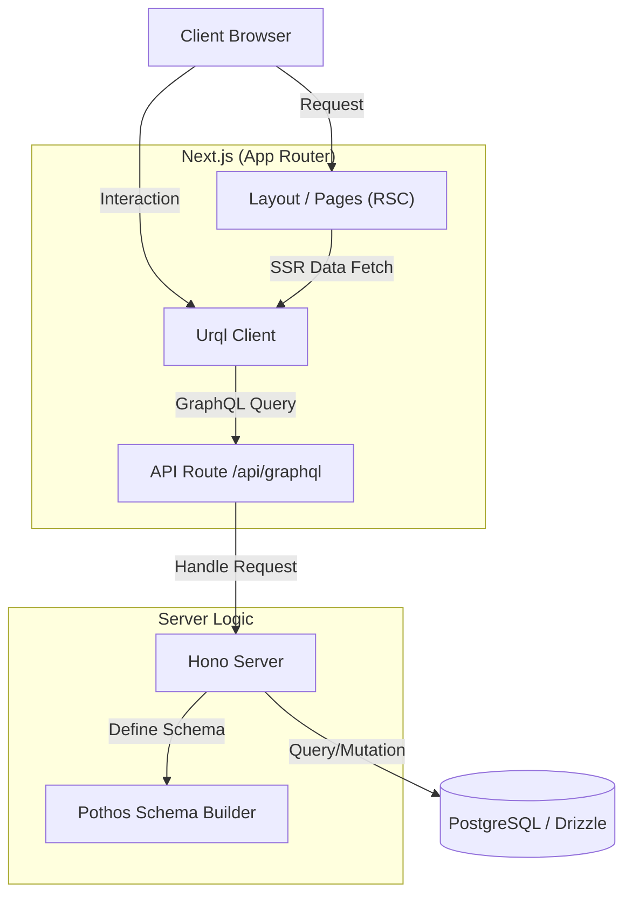
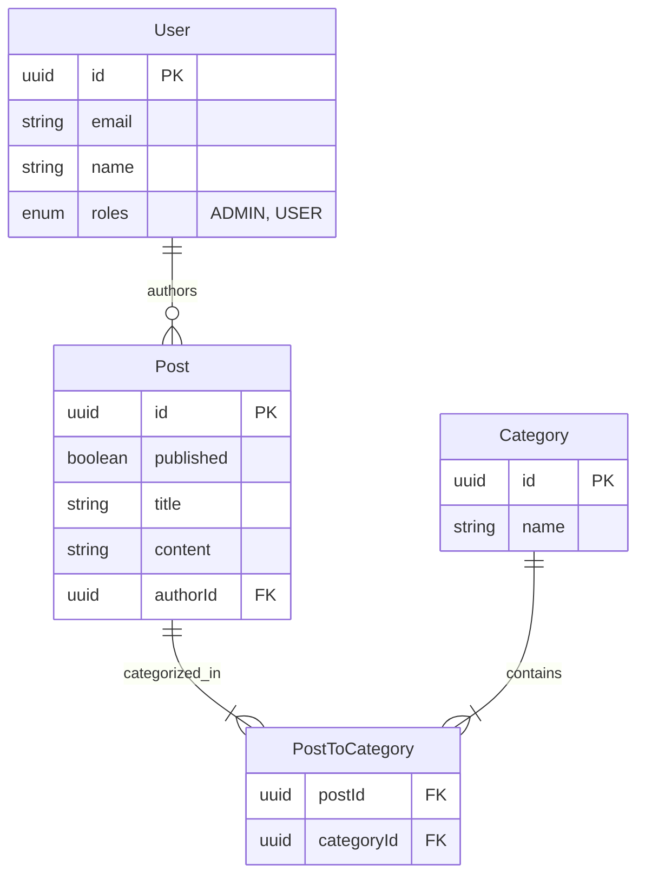
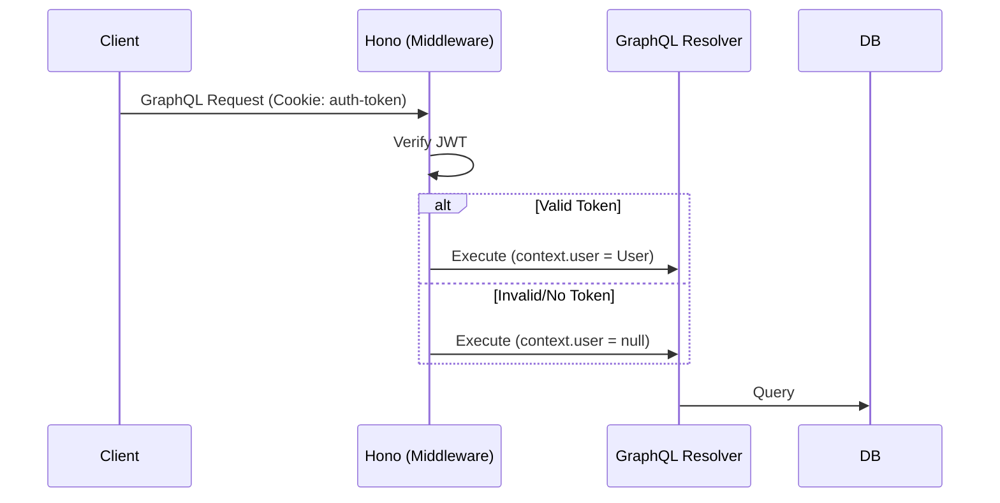
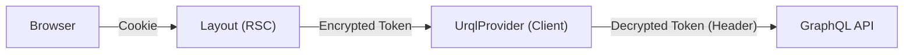

# next-drizzle

Next.js、Drizzle ORM、GraphQL で構築された実装サンプルです。このプロジェクトは、Drizzle ORM で作せした構造を、記述コード最小で GraphQL 化し、Next.js から SSR 対応で呼び出します。リレーションを伴うクエリは最適化されるため、GraphQL で問題にされる N+1 は起こりません。また、SSR に関してはデータの取得を ClientComponent 上から行うため、サーバーとブラウザでデータの取得処理を一本化できます。

## はじめに

### プロジェクト構成

- `src/`: アプリケーションのソースコード
  - `app/`: Next.js App Router ページと API ルート
  - `components/`: 共有 UI コンポーネント（StoreProvider など）
  - `db/`: Drizzle スキーマとリレーション定義
  - `generated/`: 生成された GraphQL 型とフック
  - `hooks/`: カスタム React フック
  - `libs/`: ユーティリティライブラリ
  - `server/`: GraphQL サーバーロジックとスキーマビルダー
- `codegen/`: GraphQL Code Generator 設定
- `drizzle/`: データベースマイグレーションファイル
- `tools/`: シーディングと管理用スクリプト

### 機能

- **投稿管理:**
  - 投稿リストの表示（ホームページ）。
  - 新規投稿の作成（タイトル、コンテンツ、公開ステータス、カテゴリ）。
  - 既存の投稿の編集。
  - 投稿の削除。
  - 下書きシステム（公開/非公開投稿）。
- **ユーザーシステム:**
  - ユーザー切り替え/認証（デモ用に簡略化/シミュレート）。
  - ユーザーロール。
- **カテゴリ管理:**
  - 投稿のカテゴリ分け。

### 技術スタック

- **フレームワーク:** [Next.js](https://nextjs.org/) (App Router)
- **言語:** TypeScript
- **データベース:** PostgreSQL
- **ORM:** [Drizzle ORM](https://orm.drizzle.team/)
- **API:** GraphQL (サーバー: Hono + Pothos, クライアント: Urql)
- **スタイリング:** Tailwind CSS
- **認証:** カスタム JWT 認証
- **コード生成:** GraphQL Codegen

### アーキテクチャ概要



### 前提条件

- Node.js (v18+)
- pnpm (推奨）または npm/yarn
- Docker (データベース用）

### インストールとセットアップ

1.  **依存関係のインストール:**

    ```bash
    pnpm install
    ```

2.  **データベースの起動:**
    Docker Compose を使用して PostgreSQL を起動します。

    ```bash
    pnpm docker
    ```

3.  **データベースのセットアップ (マイグレーション & シード):**
    スキーマの初期化とシードデータのロードを行います。

    ```bash
    pnpm drizzle:reset
    ```

4.  **開発サーバーの起動:**

    ```bash
    pnpm dev
    ```

5.  **アプリケーションへのアクセス:**
    ブラウザで [http://localhost:3000](http://localhost:3000) を開きます。

## スクリプト

- `dev`: Next.js 開発サーバーを起動します。
- `docker`: PostgreSQL コンテナを起動します。
- `graphql:codegen`: GraphQL の変更を監視し、TypeScript の型を生成します。
- `graphql:schema`: GraphQL スキーマをエクスポートします。
- `drizzle:generate`: スキーマ変更に基づいて SQL マイグレーションを生成します。
- `drizzle:migrate`: マイグレーションをデータベースに適用します。
- `drizzle:seed`: テストデータをデータベースにシードします。
- `drizzle:reset`: データベースをリセットします（マイグレーション + シード）。
- `lint`: ESLint を実行します。

## アーキテクチャと実装詳細

このプロジェクトでは、コードファーストアプローチを使用して GraphQL スキーマを生成し、軽量なサーバーセットアップと堅牢な認証システムを実装しています。

### GraphQL サーバーとスキーマ設計

本プロジェクトでは、**Code-First** アプローチを採用し、型安全性と開発効率を最大化しています。

#### 1. データモデル (ER 図)



#### 2. スキーマの自動生成 (`src/server/builder.ts`)

[Pothos](https://pothos-graphql.dev/) と Drizzle プラグインを組み合わせることで、DB スキーマから GraphQL スキーマを自動生成します。

- **自動化**: `drizzle-orm` の定義を読み取り、Query/Mutation を即座に作成。
- **セキュリティ (RLS)**:
  - `executable`: 認証済みユーザーのみ Mutation を許可。
  - `where`: ユーザー ID に基づき、取得・更新できるデータを自動フィルタリング（行レベルセキュリティ）。
- **カスタマイズ**: 中間テーブルの除外や、システム管理フィールド（`createdAt` など）の入力不可設定。

```ts
import SchemaBuilder from "@pothos/core";
import DrizzlePlugin from "@pothos/plugin-drizzle";
import { getTableConfig } from "drizzle-orm/pg-core";
import { GraphQLSchema } from "graphql";
import { setCookie } from "hono/cookie";
import { SignJWT } from "jose";
import PothosDrizzleGeneratorPlugin, {
  isOperation,
} from "pothos-drizzle-generator";
import { relations } from "../db/relations";
import type { Context } from "./context";
import type { Context as HonoContext } from "hono";
import { getEnvVariable } from "../libs/getEnvVariable";
import { db } from "./drizzle";

// Secret key for JWT token signing and verification
const SECRET = getEnvVariable("SECRET");

// JWT token expiration time: 400 days in seconds
const TOKEN_MAX_AGE = 60 * 60 * 24 * 400;

// Cookie configuration shared across authentication operations
const COOKIE_OPTIONS = {
  httpOnly: true,
  sameSite: "strict" as const,
  path: "/",
};

// Tables to exclude from GraphQL schema generation
// Junction tables like "postsToCategories" are typically excluded
const EXCLUDE_TABLES: Array<keyof typeof relations> = ["postsToCategories"];

export interface PothosTypes {
  DrizzleRelations: typeof relations;
  Context: HonoContext<Context>;
}

/**
 * Initialize Pothos Schema Builder with plugins:
 * - DrizzlePlugin: Integrates Drizzle ORM with Pothos
 * - PothosDrizzleGeneratorPlugin: Automatically generates GraphQL schema from Drizzle schema
 */
const builder = new SchemaBuilder<PothosTypes>({
  plugins: [DrizzlePlugin, PothosDrizzleGeneratorPlugin],
  drizzle: {
    client: () => db,
    relations,
    getTableConfig,
  },
  pothosDrizzleGenerator: {
    // Exclude specific tables from schema generation (e.g., junction tables)
    use: { exclude: EXCLUDE_TABLES },
    // Global configuration applied to all models
    all: {
      // Maximum query depth to prevent deeply nested queries (protection against DoS)
      depthLimit: () => 5,
      // Controls whether operations (findMany, findFirst, count, create, update, delete) are executable
      // This guards against unauthorized mutations by requiring authentication
      executable: ({ operation, ctx }) => {
        if (isOperation(["mutation"], operation) && !ctx.get("user")) {
          return false;
        }
        return true;
      },
      // Configure input fields for create/update operations
      // Excludes auto-managed system fields from user input
      inputFields: () => {
        return { exclude: ["createdAt", "updatedAt"] };
      },
    },
    // Model-specific configuration
    models: {
      posts: {
        // Automatically inject data during create/update operations
        // Sets authorId to the current authenticated user
        inputData: ({ ctx }) => {
          const user = ctx.get("user");
          if (!user) throw new Error("No permission");
          return { authorId: user.id };
        },
        // Apply WHERE clause filters based on operation type
        // This implements row-level security
        where: ({ ctx, operation }) => {
          // For queries (findMany, findFirst, count): show published posts or user's own posts
          if (isOperation(["query"], operation)) {
            return {
              OR: [{ authorId: ctx.get("user")?.id }, { published: true }],
            };
          }
          // For mutations (create, update, delete): only allow operations on user's own posts
          if (isOperation(["mutation"], operation)) {
            return { authorId: ctx.get("user")?.id };
          }
        },
      },
    },
  },
});

builder.queryType({
  fields: (t) => ({
    // Returns the currently authenticated user
    me: t.drizzleField({
      type: "users",
      nullable: true,
      resolve: (_query, _root, _args, ctx) => {
        const user = ctx.get("user");
        return user || null;
      },
    }),
  }),
});

/**
 * Authentication mutations
 * Provides user authentication functionality including sign-in, sign-out, and current user retrieval
 */
builder.mutationType({
  fields: (t) => ({
    // Authenticates a user by email and sets JWT cookie
    signIn: t.drizzleField({
      args: { email: t.arg({ type: "String" }) },
      type: "users",
      nullable: true,
      resolve: async (_query, _root, { email }, ctx) => {
        const user =
          email &&
          (await db.query.users.findFirst({ where: { email: email } }));
        if (!user) {
          // Authentication failed: clear any existing auth cookie
          setCookie(ctx, "auth-token", "", { ...COOKIE_OPTIONS, maxAge: 0 });
        } else {
          // Authentication successful: generate JWT and set secure cookie
          const token = await new SignJWT({ user: user })
            .setProtectedHeader({ alg: "HS256" })
            .sign(new TextEncoder().encode(SECRET));
          setCookie(ctx, "auth-token", token, {
            ...COOKIE_OPTIONS,
            maxAge: TOKEN_MAX_AGE,
          });
        }
        return user || null;
      },
    }),
    // Signs out the current user by clearing the authentication cookie
    signOut: t.field({
      args: {},
      type: "Boolean",
      nullable: true,
      resolve: async (_root, _args, ctx) => {
        setCookie(ctx, "auth-token", "", { ...COOKIE_OPTIONS, maxAge: 0 });
        return true;
      },
    }),
  }),
});

export const schema: GraphQLSchema = builder.toSchema({ sortSchema: false });
```

#### 3. Hono によるサーバー構築 (`src/server/hono.ts`)

GraphQL サーバーの実体には、軽量・高速な [Hono](https://hono.dev/) を使用しています。

- **認証ミドルウェア**: Cookie 内の JWT を検証し、コンテキストに `user` をセットします。
- **Apollo Explorer**: ブラウザでアクセスした際に、クエリをテストできる IDE を提供します。
- **GraphQL エンドポイント**: `@hono/graphql-server` を使用してリクエストを処理します。

```ts
import { graphqlServer } from "@hono/graphql-server";
import { explorer } from "apollo-explorer/html";
import { generate } from "graphql-auto-query";
import { Hono } from "hono";
import { contextStorage } from "hono/context-storage";
import { getContext } from "hono/context-storage";
import { getCookie } from "hono/cookie";
import { jwtVerify } from "jose";
import { schema } from "./builder";
import type { Context } from "./context.js";
import type { relations } from "../db/relations";
import type { Context as HonoContext } from "hono";
import { getEnvVariable } from "@/libs/getEnvVariable";

// Secret key for JWT verification
const SECRET = getEnvVariable("SECRET");

// Cookie name for authentication token
const AUTH_TOKEN_COOKIE = "auth-token";

// Apollo Explorer introspection interval (10 seconds)
const INTROSPECTION_INTERVAL = 10000;

// Sample query generation depth
const QUERY_GENERATION_DEPTH = 1;

/**
 * Middleware to extract and verify JWT token from cookies
 * Sets the authenticated user in the request context
 */
const authMiddleware = async (
  c: HonoContext<Context>,
  next: () => Promise<void>
) => {
  const cookies = getCookie(c);
  const token = cookies[AUTH_TOKEN_COOKIE] ?? "";

  /**
   * Verify JWT token and extract user information
   * If verification fails (invalid/expired token), user will be undefined
   */
  const user = await jwtVerify(token, new TextEncoder().encode(SECRET))
    .then(
      (data) => data.payload.user as typeof relations.users.table.$inferSelect
    )
    .catch(() => undefined);
  // Store user in request context
  const context = getContext<Context>();
  context.set("user", user);

  return next();
};

/**
 * Initialize Hono application with custom context type
 * The Context type provides type-safe access to user authentication state
 */
export const app = new Hono<Context>();

/**
 * Enable context storage middleware
 * This allows access to the request context from anywhere in the application
 */
app.use(contextStorage());

/**
 * Apollo Explorer endpoint
 * Provides an interactive GraphQL IDE for testing queries and mutations
 */
app.get("*", (c) => {
  return c.html(
    explorer({
      initialState: {
        // Auto-generate sample GraphQL operations from the schema
        document: generate(schema, QUERY_GENERATION_DEPTH),
      },
      // GraphQL endpoint URL for the explorer to connect to
      endpointUrl: c.req.url,
      // Automatically refresh schema periodically
      introspectionInterval: INTROSPECTION_INTERVAL,
    })
  );
});

/**
 * GraphQL endpoint
 * Handles GraphQL queries and mutations via POST requests
 * Authentication is handled by the authMiddleware
 */
app.post("*", authMiddleware, (c, next) => {
  return graphqlServer({
    schema,
  })(c, next);
});
```

#### 4. Next.js Route Handler への統合 (`src/app/api/graphql/route.ts`)

Hono で構築したサーバーは Web Standard API に準拠しているため、Next.js の Route Handler としてそのままマウント可能です。

```ts
"use server";
import { app } from "../../../server/hono";

export async function POST(request: Request) {
  return app.fetch(request);
}

export async function GET(request: Request) {
  return app.fetch(request);
}
```

## 5. 認証と認可のフロー

セキュリティと UX を両立させるため、堅牢な認証フローと、透過的な SSR 対応を実装しています。

### A. 認証 (Authentication)

サーバーサイドでの身元確認プロセスです。

1.  **JWT 生成**: `signIn` Mutation でユーザーを検証後、署名付き JWT を生成します。
2.  **Cookie 保存**: `HttpOnly`, `SameSite: Strict` 属性を持つ Cookie に保存し、XSS 対策を行います。
3.  **リクエスト検証**: Hono のミドルウェアがリクエスト毎に検証を行い、コンテキストに `user` オブジェクトを注入します。



### B. 認可 (Authorization)

「誰が何をできるか」の制御を、GraphQL スキーマレベルで強制します。

- **Mutation 保護**: 未認証ユーザーによる書き込み操作（作成・更新・削除）を一括でブロック。
- **行レベルセキュリティ (RLS)**:
  - **Read**: 公開記事、または自分の下書き記事のみ取得可能。
  - **Write**: 自分が作成した記事のみ編集・削除可能。
  - これらは Pothos の `where` オプションで自動的にクエリに組み込まれます。

### C. SSR における認証トークンの受け渡し

Next.js (Server Component) から GraphQL API (内部通信）へ認証状態を引き継ぐための仕組みです。

- **課題**: SSR 時の内部 `fetch` リクエストには、ブラウザの Cookie が自動付与されません。
- **解決策**:
  1.  `Layout.tsx` (RSC) で Cookie を読み取り、暗号化します。
  2.  `UrqlProvider` (Client Component) に Props として渡します。
  3.  `UrqlProvider` 内で復号し、SSR 中の GraphQL リクエストヘッダーに手動でセットします。



#### 3. フロントエンド統合（状態管理とフック）

サーバーサイドの認証状態（Cookie）と同期しつつ、クライアントサイドでリアクティブな UI を実現するための構成です。

##### A. 軽量なグローバル状態管理 (`src/components/StoreProvider.tsx`)

React 18 の `useSyncExternalStore` を活用したカスタムストアを実装しています。

- **特徴**: Redux などの外部ライブラリに依存せず、軽量かつ効率的に「現在のログインユーザー」をアプリケーション全体で共有します。
- **メリット**: 不要な再レンダリングを防ぎ、SSR データ（`UrqlProvider` 経由で渡される初期状態）との整合性を保ちます。

##### B. 認証用カスタムフック (`src/hooks/useAuth.ts`)

認証操作をカプセル化したフックを提供し、コンポーネントから簡単に利用できるようにしています。

| フック名       | 役割                                                                                   |
| :------------- | :------------------------------------------------------------------------------------- |
| `useUser()`    | 現在ログインしているユーザー情報を取得します。                                         |
| `useSignIn()`  | `signIn` Mutation を実行し、完了後にローカルストアを更新して UI に即座に反映させます。 |
| `useSignOut()` | `signOut` Mutation を実行し、Cookie 削除とともにローカルストアをリセットします。       |

##### 認証の実装例

ここではサンプル用にメールアドレスだけで認証を行っています。必要に応じてパスワードや OAuth などの仕組みを導入してください。このサンプルでは、signIn が成功すると、httpOnly の Cookie 作られ、urql のキャッシュを削除します。

```tsx
"use client";
import { useFindManyUserQuery } from "@/generated/graphql";
import { useSignIn } from "@/hooks/useAuth";
import Link from "next/link";

export default function Home() {
  const [{ data, fetching, error }] = useFindManyUserQuery();
  const signIn = useSignIn();

  if (fetching) return <div>Loading...</div>;
  if (error) return <div>Error: {error.message}</div>;

  return (
    <div className="p-4">
      <Link href="/" className="text-blue-500 hover:underline mb-4 block">
        &larr; Back to Home
      </Link>
      <h1 className="text-2xl font-bold mb-4">Users</h1>
      <div className="grid gap-4">
        {data?.findManyUser?.map((user) => (
          <div
            key={user.id}
            className="border p-4 rounded shadow flex justify-between items-center"
          >
            <div>
              <div className="font-bold">{user.name}</div>
              <div className="text-gray-500">{user.email}</div>
            </div>
            <button
              onClick={() => signIn(user.email)}
              className="btn bg-blue-500 text-white px-4 py-2 rounded hover:bg-blue-600"
            >
              Sign In
            </button>
          </div>
        ))}
      </div>
    </div>
  );
}
```

## 4. データフェッチと SSR の統合

Next.js App Router 上で、Client Component からのデータ取得を SSR 対応させるための仕組みです。

### `@react-libraries/next-exchange-ssr` の活用

通常、Client Component でのデータ取得（`useQuery`など）はクライアントサイドでのみ実行されますが、本プロジェクトでは `@react-libraries/next-exchange-ssr` を導入することで、以下の挙動を実現しています。

1.  **SSR 時のデータプリフェッチ**: サーバーサイドレンダリング中に実行されたクエリの結果を収集します。
2.  **ハイドレーション**: 収集したデータを HTML に埋め込み、クライアントサイドでの再フェッチを防ぎます。
3.  **RSC 不要**: ページコンポーネントを `use client` としても、SEO や初期表示パフォーマンスを損ないません。

### 実装例: 投稿一覧ページ

以下のコードは Client Component ですが、初回アクセス時にはサーバーサイドでデータが取得され、完成された HTML がブラウザに届きます。SSR とブラウザ動作時のロジックが共通の記述になり、データの取得に関してサーバー側専用のコードを書く必要がありません。

- `useUser()`: ログインユーザー情報の取得。
- `useFindManyPostQuery()`: 投稿データの取得（SSR 対応）。

```tsx
"use client";
import { useFindManyPostQuery, OrderBy } from "@/generated/graphql";
import { useUser } from "@/hooks/useAuth";
import Link from "next/link";

export default function Home() {
  const user = useUser();
  const [{ data, error, fetching }] = useFindManyPostQuery({
    variables: { orderBy: [{ createdAt: OrderBy.Desc }] },
  });

  if (fetching) return <div>Loading...</div>;
  if (error) return <div>Error: {error.message}</div>;
  return (
    <div className="p-4 grid gap-4">
      <Link href="/posts/new" className="btn btn-primary w-fit">
        Create New Post
      </Link>
      <h1 className="text-2xl font-bold">Posts</h1>
      {data?.findManyPost?.map((post) => (
        <div
          key={post.id}
          className={`card bg-base-100 shadow-xl ${
            !post.published ? "bg-base-200" : ""
          } ${user?.id === post.authorId ? "border-2 border-primary" : ""}`}
        >
          <div className="card-body">
            <div className="flex justify-between items-start">
              <h2 className="card-title">{post.title}</h2>
              <Link
                href={`/posts/${post.id}`}
                className="btn btn-outline btn-primary btn-sm"
              >
                Edit
              </Link>
            </div>
            <div className="text-sm text-base-content/70">
              {post.author && <span>By {post.author.name} • </span>}
              {new Date(post.createdAt).toLocaleString()}
            </div>
            <p className="mt-2">{post.content}</p>
            {post.categories && post.categories.length > 0 && (
              <div className="card-actions mt-2">
                {post.categories.map((category) => (
                  <div key={category.id} className="badge badge-outline">
                    {category.name}
                  </div>
                ))}
              </div>
            )}
          </div>
        </div>
      ))}
    </div>
  );
}
```
