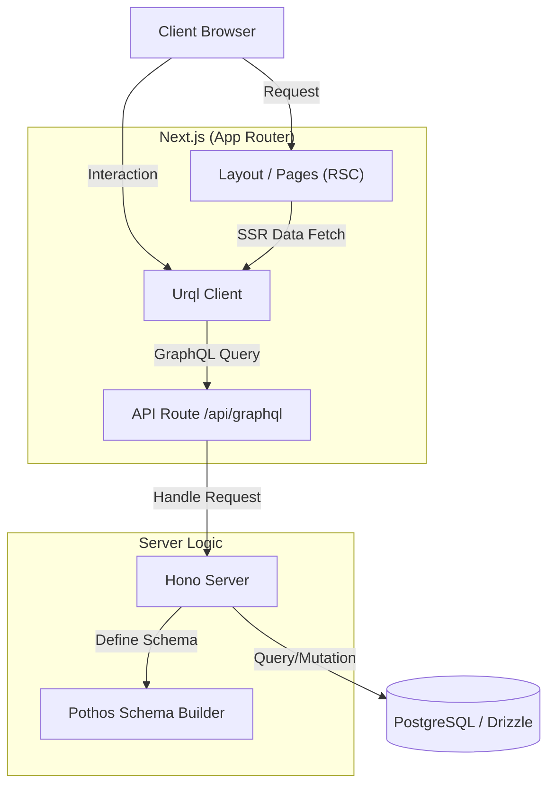
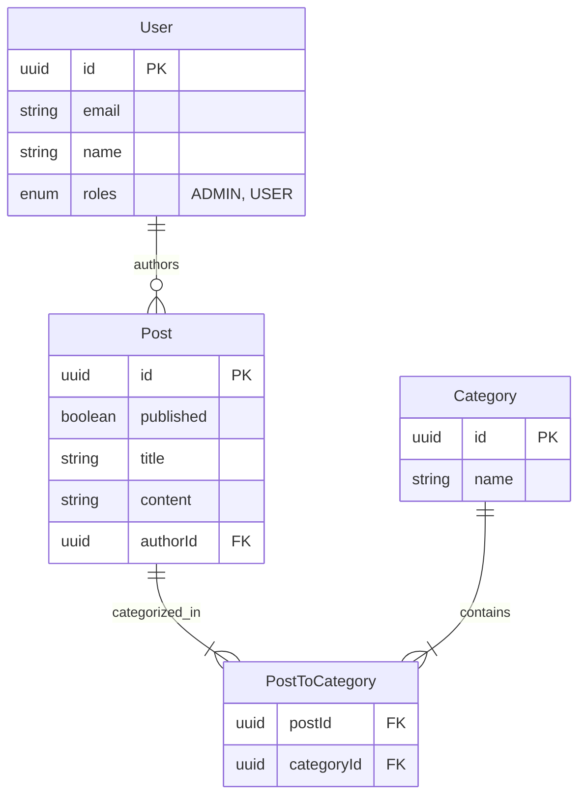

# next-drizzle

Next.js、Drizzle ORM、GraphQL で構築された実装サンプルです。このプロジェクトは、効率的なデータ管理とレンダリングのための最新技術を使用したフルスタックアーキテクチャを実証しています。

## 機能

- **投稿管理:**
  - 投稿リストの表示（ホームページ）。
  - 新規投稿の作成（タイトル、コンテンツ、公開ステータス、カテゴリ）。
  - 既存の投稿の編集。
  - 投稿の削除。
  - 下書きシステム（公開/非公開投稿）。
- **ユーザーシステム:**
  - ユーザー切り替え/認証（デモ用に簡略化/シミュレート）。
  - ユーザーロール。
- **カテゴリ管理:**
  - 投稿のカテゴリ分け。

## 技術スタック

- **フレームワーク:** [Next.js](https://nextjs.org/) (App Router)
- **言語:** TypeScript
- **データベース:** PostgreSQL
- **ORM:** [Drizzle ORM](https://orm.drizzle.team/)
- **API:** GraphQL (サーバー: Hono + Pothos, クライアント: Urql)
- **スタイリング:** Tailwind CSS
- **認証:** カスタム JWT 認証
- **コード生成:** GraphQL Codegen

### アーキテクチャ概要



## はじめに

### 前提条件

- Node.js (v18+)
- pnpm (推奨）または npm/yarn
- Docker (データベース用）

### インストールとセットアップ

1.  **依存関係のインストール:**

    ```bash
    pnpm install
    ```

2.  **データベースの起動:**
    Docker Compose を使用して PostgreSQL を起動します。

    ```bash
    pnpm docker
    ```

3.  **データベースのセットアップ (マイグレーション & シード):**
    スキーマの初期化とシードデータのロードを行います。

    ```bash
    pnpm drizzle:reset
    ```

4.  **開発サーバーの起動:**

    ```bash
    pnpm dev
    ```

5.  **アプリケーションへのアクセス:**
    ブラウザで [http://localhost:3000](http://localhost:3000) を開きます。

## スクリプト

- `dev`: Next.js 開発サーバーを起動します。
- `docker`: PostgreSQL コンテナを起動します。
- `graphql:codegen`: GraphQL の変更を監視し、TypeScript の型を生成します。
- `graphql:schema`: GraphQL スキーマをエクスポートします。
- `drizzle:generate`: スキーマ変更に基づいて SQL マイグレーションを生成します。
- `drizzle:migrate`: マイグレーションをデータベースに適用します。
- `drizzle:seed`: テストデータをデータベースにシードします。
- `drizzle:reset`: データベースをリセットします（マイグレーション + シード）。
- `lint`: ESLint を実行します。

## アーキテクチャと実装詳細

このプロジェクトでは、コードファーストアプローチを使用して GraphQL スキーマを生成し、軽量なサーバーセットアップと堅牢な認証システムを実装しています。

### GraphQL サーバーとスキーマ

- **スキーマ生成 (`src/server/builder.ts`):**

  - **Pothos:** TypeScript 用の型安全な GraphQL スキーマビルダーである [Pothos](https://pothos-graphql.dev/) を使用しています。
  - **Drizzle Plugin:** `@pothos/plugin-drizzle` および `pothos-drizzle-generator` プラグインを使用し、`src/db/schema.ts` で定義された Drizzle ORM スキーマから GraphQL の型とフィールドを自動生成します。
  - **カスタマイズ:** 中間テーブル（例: `postsToCategories`）の除外や、入力タイプからのシステムフィールド（例: `createdAt`, `updatedAt`）の除外を行っています。

- **サーバー構成 (`src/server/hono.ts`):**
  - **Hono:** 高速で軽量な Web フレームワークである [Hono](https://hono.dev/) を GraphQL サーバーとして採用しています。
  - **Apollo Explorer:** `GET` エンドポイントで Apollo Explorer を提供し、クエリのテストが可能なプレイグラウンドを利用できます。
  - **GraphQL エンドポイント:** `POST` エンドポイントは `@hono/graphql-server` を使用してリクエストを処理します。

#### データモデル (ER 図)



### 認証と認可

セキュリティと使いやすさを考慮したカスタム認証システムを実装しています。

#### 1. 認証の仕組み (サーバーサイド)

- **サインインフロー:**

  - ユーザーはメールアドレスでサインインします（デモ用のためパスワードレス）。
  - `signIn` ミューテーション (`src/server/builder.ts`) がユーザーを検証し、成功すると `jose` ライブラリで JWT (JSON Web Token) を生成します。
  - トークンは `HttpOnly`, `SameSite: Strict` 属性を持つ `auth-token` Cookie として設定され、XSS 攻撃から保護されます。

- **リクエスト検証:**

  - Hono の `authMiddleware` がリクエストごとに Cookie から JWT を検証します。
  - 検証されたユーザー情報は Hono のコンテキスト (`contextStorage`) に保存され、GraphQL リゾルバからアクセス可能になります。

- **セキュリティと認可:**
  - **ミューテーション保護:** Pothos プラグインの設定により、認証されていないユーザーによるデータ変更（ミューテーション）をブロックします。
  - **行レベルセキュリティ (RLS):** クエリやミューテーションに自動的に `where` 句を注入し、ユーザーが自分のデータのみを操作できるように制御します（例：編集は自分の投稿のみ許可）。

#### 2. SSR 時の認証トークンの取り扱い

Next.js の App Router (Server Components) と URQL (Client Components) を組み合わせる際、SSR (Server-Side Rendering) 中に認証済みリクエストを行うための特別な処理を実装しています。

- **課題:**

  - ブラウザからのリクエストには自動的に Cookie が付与されますが、SSR 中に Next.js サーバーから自身の API ルートへ `fetch` する際は、ブラウザの Cookie は自動的に引き継がれません。
  - そのため、URQL クライアントに認証トークンを明示的に渡す必要があります。

- **解決策:**

  1.  **暗号化して渡す (`src/app/layout.tsx`):**

      - ルートレイアウト（Server Component）で Cookie から `auth-token` を取得します。
      - このトークンを `src/libs/encrypt.ts` の `encrypt` 関数で暗号化し、`UrqlProvider` の props として渡します。
      - **目的:** 生のトークンを Client Component の props として露出させるリスクを軽減し、セキュアに SSR コンテキストへ渡すためです。

  2.  **復号して使用する (`src/components/UrqlProvider.tsx`):**

      - `UrqlProvider` 内で `urql` クライアントを初期化する際、`isServerSide` (SSR 中）であるかを判定します。
      - SSR 中であれば、受け取った暗号化トークンを `decrypt` 関数で復号し、GraphQL リクエストの `cookie` ヘッダーに `auth-token=...` として手動で付与します。
      - これにより、SSR 中に生成されるクエリも認証済みとして処理され、初期表示でユーザー固有のデータを正しく取得できます。

      ```mermaid
      sequenceDiagram
          participant Browser
          participant NextServer as Next.js Server (RSC)
          participant UrqlProvider as Urql Provider (SSR)
          participant API as GraphQL API

          Note over Browser, API: Initial Page Load (SSR)
          Browser->>NextServer: Request Page (Cookie: auth-token)
          NextServer->>NextServer: Layout: Read Cookie
          NextServer->>NextServer: Encrypt Token
          NextServer->>UrqlProvider: Pass Encrypted Token (Props)
          UrqlProvider->>UrqlProvider: Decrypt Token
          UrqlProvider->>API: Fetch Query (Header: Cookie=auth-token)
          API-->>UrqlProvider: Data
          UrqlProvider-->>NextServer: Hydrate State
          NextServer-->>Browser: Rendered HTML
      ```

#### 3. フロントエンドでの利用

フロントエンドでは、認証状態を管理し、ユーザー体験をスムーズにするために以下の仕組みを採用しています。

- **状態管理 (`src/components/StoreProvider.tsx`):**

  - カスタムの `StoreProvider` と `useSyncExternalStore` (React 18) を使用し、アプリケーション全体で軽量かつ効率的にログインユーザー情報を管理しています。

- **カスタムフック (`src/hooks/useAuth.ts`):**

  - `useUser()`: 現在ログインしているユーザー情報を取得します。
  - `useSignIn()`: GraphQL の `signIn` ミューテーションを実行し、成功時にストアを更新します。
  - `useSignOut()`: `signOut` ミューテーションで Cookie をクリアし、ストアの状態をリセットします。

- **実装例 (`src/app/users/page.tsx`):**
  - ユーザー一覧画面の "Sign In" ボタンは、`useSignIn` フックを使用して即座にそのユーザーとしてログインするデモ機能を実装しています。

## プロジェクト構成

- `src/`: アプリケーションのソースコード
  - `app/`: Next.js App Router ページと API ルート
  - `components/`: 共有 UI コンポーネント（StoreProvider など）
  - `db/`: Drizzle スキーマとリレーション定義
  - `generated/`: 生成された GraphQL 型とフック
  - `hooks/`: カスタム React フック
  - `libs/`: ユーティリティライブラリ
  - `server/`: GraphQL サーバーロジックとスキーマビルダー
- `codegen/`: GraphQL Code Generator 設定
- `drizzle/`: データベースマイグレーションファイル
- `tools/`: シーディングと管理用スクリプト
